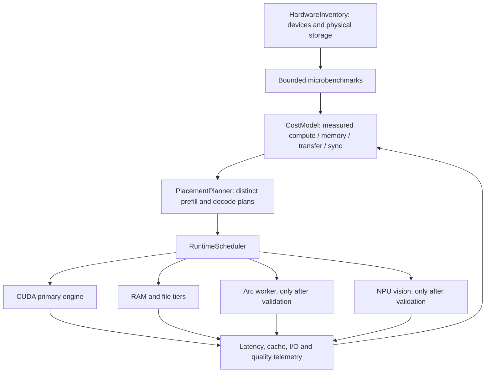

# Runtime architecture

The current source is a CUDA/HIP engine with host expert workers, a Python API server and a separate experimental SYCL engine. The hetero extension retains the CUDA engine as the session owner. It retains upstream's quantization, router, KV formats, MTP verify/commit and model file validation.

No new backend is enabled merely because a PnP device exists. An unavailable runtime, compilation failure, failed correctness check or slow helper produces an explicit unavailable/disabled route with an ordinary CPU/CUDA fallback. Keep that distinct from a measured performance regression.

The first memory prototype reuses `platform::lock_resident` for a Windows PLE mapping and requires a complete lock. Host byte/gather fixtures, the full CUDA build and CLI parsing have passed; model experiments remain pending. A successful table warmup is not proof of residency. The process's existing expert arena and shared-memory budget remain part of memory admission. A RAM mode must fail or report fallback clearly when it cannot meet its requested guarantees.

Storage placement uses physical-device identities and measured access patterns. Startup parallelism has bounded in-flight buffers and RAM/commit limits, with error propagation and cancellation. A copy is not active until its bytes have been verified. The original model remains intact.

The Arc worker is initially a separate process/runtime. It receives an explicit expert job and returns weighted outputs; the CUDA session owns ordering and commit. Its cost includes transport, weight availability, synchronization and contention with CPU workers. Prefill batch crossover is measured before tiny decode batches. No CUDA+SYCL layer split is assumed.

NPU begins with a static vision encoder. The exact preprocessing, shape, output embedding and model identity must match the existing vision path. Device compilation and model quality are separate evidence from latency and GPU VRAM savings. NPU MTP/full MoE are candidates, not accepted routes.

Profile persistence contains hardware/runtime/model/source identity, measurement samples, validity age and enabled routes. Stale or mismatched profiles revert to safe defaults. Runtime predictions are updated from measured completion times; round-robin hardware use is not the scheduling objective.
