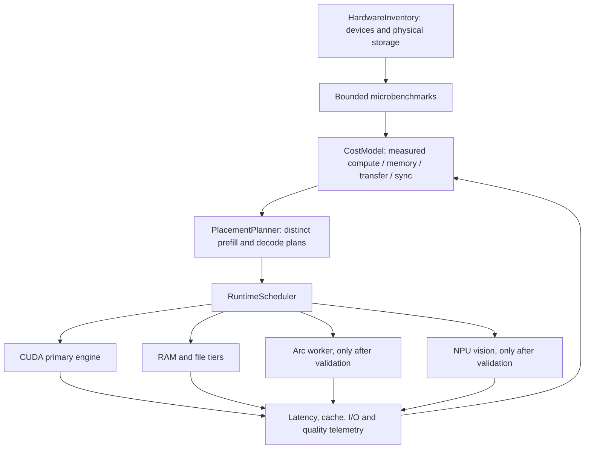

# Runtime architecture

The current source is a CUDA/HIP engine with host expert workers, a Python API server and a separate experimental SYCL engine. The hetero extension retains the CUDA engine as the session owner. It retains upstream's quantization, router, KV formats, MTP verify/commit and model file validation.

No new backend is enabled merely because a PnP device exists. An unavailable runtime, compilation failure, failed correctness check or slow helper produces an explicit unavailable/disabled route with an ordinary CPU/CUDA fallback. Keep that distinct from a measured performance regression.

The Windows PLE mapping reuses `platform::lock_resident` and requires a complete lock. Host byte/gather fixtures, matched CUDA builds and CLI parsing have passed. The first full-RAM prototype failed natural 1K retrieval despite passing short tasks; the instrumented success did not prove a repair. The latest integration uses upstream's direct VirtualLock fault-in and retains strict reserve/locked-byte checks. Its direct control passed all 27 task/token pairs against latest upstream; H5 and H21 full-RAM runs retain correctness failures, including degradation persisting into subsequent requests in H21. A successful table warmup is not proof of residency or model correctness. The expert arena and shared-memory budget remain part of admission. RAM mode must fail or report fallback clearly when its requested guarantees cannot be met.

Storage placement uses physical-device identities and measured access patterns. Startup parallelism has bounded in-flight buffers and RAM/commit limits, with error propagation and cancellation. A copy is not active until its bytes have been verified. The original model remains intact.

The Arc worker is initially a separate process/runtime. It receives an explicit expert job and returns weighted outputs; the CUDA session owns ordering and commit. Its cost includes transport, weight availability, synchronization and contention with CPU workers. Prefill batch crossover is measured before tiny decode batches. No CUDA+SYCL layer split is assumed.

NPU begins with a static vision encoder. The exact preprocessing, shape, output embedding and model identity must match the existing vision path. Device compilation and model quality are separate evidence from latency and GPU VRAM savings. NPU MTP/full MoE are candidates, not accepted routes.

Profile persistence contains hardware/runtime/model/source identity, measurement samples, validity age and enabled routes. Stale or mismatched profiles revert to safe defaults. Runtime predictions are updated from measured completion times; round-robin hardware use is not the scheduling objective.

`tools/hetero_planner.py` now implements the measured job-cost selector. It prices the complete input-ready to output-ready boundary once, then adds queue and weight-readiness waits. Native and F32 operators, phases and measured row counts have separate keys; callers must include quantization, dimensions, kernel policy and weights in the operator identity. It refuses implicit shape extrapolation, unknown weight readiness and unmeasured shared-RAM contention. Hardware/runtime/model/engine identity and profile age guard reuse. Completion observations update an EMA; a failed route is quarantined. The original engine route remains the fallback.

Helper acceptance requires repeated model-quality/performance evidence rather than only a kernel microbench. The declared thresholds remain CPU 5%, storage 10%, Arc 8% with at most 2% stable regression, and NPU vision speed or GPU-VRAM savings. Nine CPU-only fixtures cover queue/weight waits, operator separation, contention, profile expiry, runtime failure and thresholds. The selector does not yet dispatch engine jobs or calibrate profiles; native transport integration, measured profile ingestion and end-to-end scheduler validation remain required.
