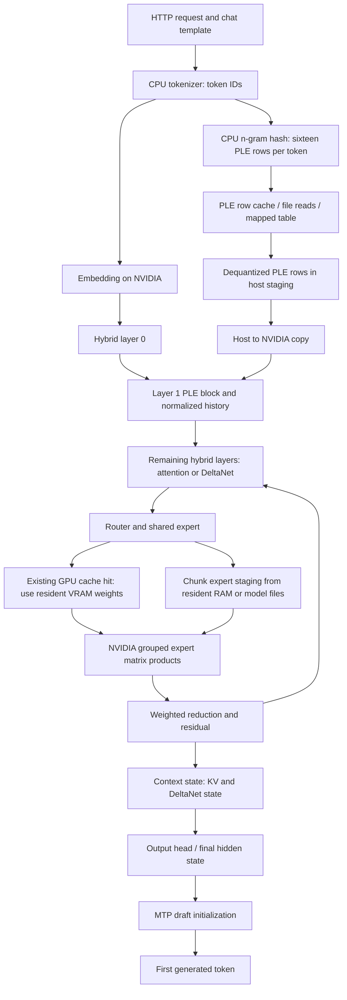
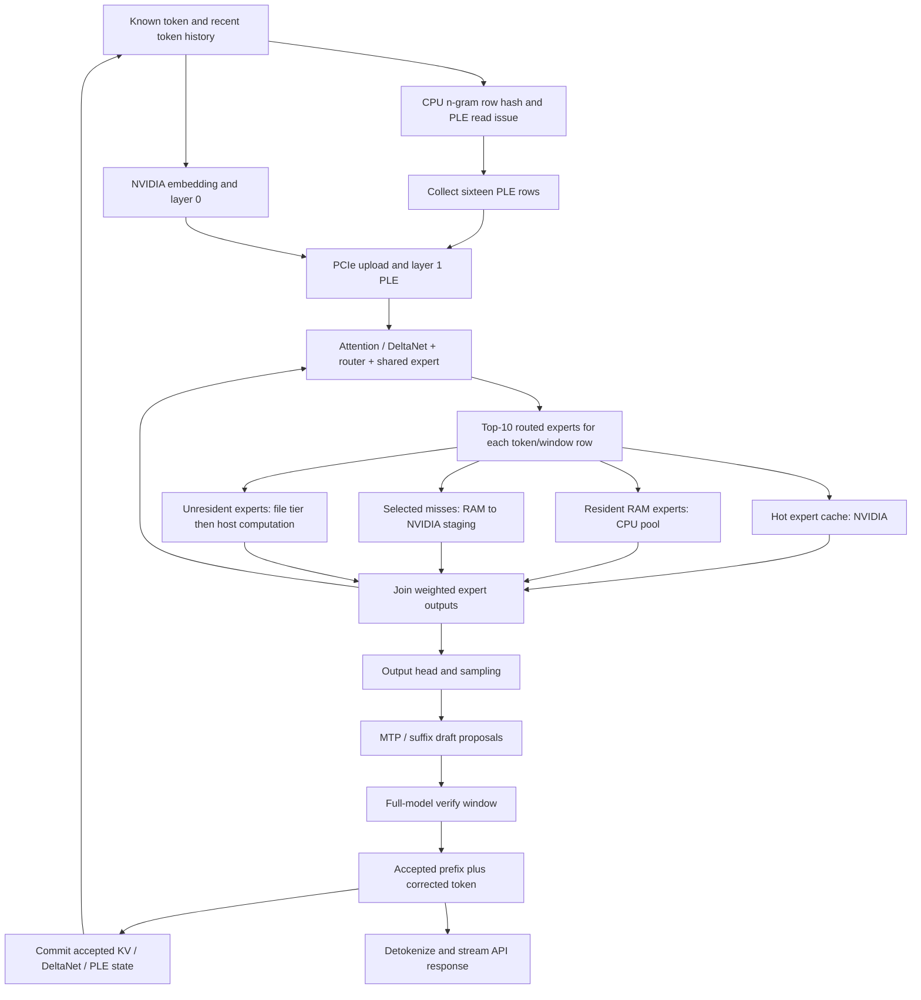
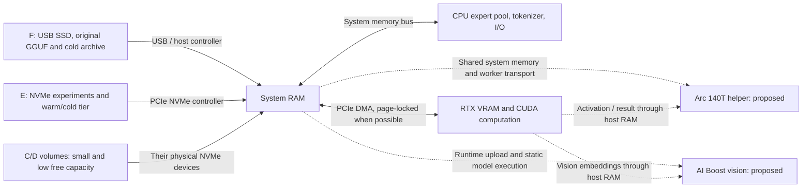

# Inference data flow

This describes upstream `82f46a8c8f475f001ad76d92f58f4a4f8ffb0253`, inspected on 2026-10-06. Solid paths below exist in that source. Arc/NPU helpers and SSD conversation persistence are proposed extensions; they are drawn separately. The model has 48 hybrid layers, 512 routed experts per layer and top-10 routing. PLE is a block at layer 1, not a lookup at every transformer layer.

## Prompt processing

The `L -> R -> ... -> L` edge means the next layer, bounded by the 48-layer loop. Prompt expert execution primarily uses the GPU's batch path and temporarily borrows expert-cache VRAM for buffers; it is not the same split as decode. A router produces expert/token groups. The prefill stager reads groups into a bounded buffer ring, copies to device, dequantizes or uses native MMQ/fused kernels, multiplies and reduces. Keep file read, staging wait, PCIe copy, dequantization and expert GEMM timings separate.

Ordinary GPU cache hits use the existing cache slot directly during prefill. Only missed or temporarily borrowed slots need another weight source. In the budgeted complement path, borrowed cache-tail experts have no extra RAM backup by default; after the prompt they are refilled through the file tier. A mapped file-tier call can still hit the OS cache, so logical file bytes do not by themselves prove physical SSD reads. The post-allocation file-cache estimate uses actual complement bytes, not the requested budget. Whether its estimate of the file working set is still too conservative for GPU-held, unborrowed experts is a candidate for measurement, not a verified bottleneck.

The PLE gather works a chunk ahead with two host buffers. A miss in direct mode reads aligned file pages; repeated rows can be served by the bounded row cache. It dequantizes the exact IQ4_NL/Q5_0/FP8 bytes selected by the table's metadata. The layer's key/value projection, gate, convolution and normalized history remain on NVIDIA. Changing the table's location must not change row bytes, row indices or history.

Source entry points: [server](../serve/server.py), [chat frontend](../serve/frontend.py), [tokenizer](../tools/strata_tokenizer.py), [prefill](../src/prefill/prefill.cpp), [expert staging](../src/core/expert_source.cpp), [PLE table](../src/kernels/ngram.cpp), [PLE reader](../src/ngram/ple_reader.cpp), [PLE GPU block](../src/kernels/cuda/ple.cu).

## Decode and speculative verification

The verify path computes the same 48-layer model for proposed tokens. MTP and suffix drafting are separate proposal sources; aggregate accepted-draft counters are not a pure MTP acceptance rate. Rejected drafts must not leave speculative KV, DeltaNet recurrent state or PLE history in the committed session. Commit can be asynchronous, but the next consumer waits for its completion. PLE issue/collect can overlap embedding and layer 0 because rows depend on the known token; unknown future token rows cannot be assumed in advance.

CPU experts and NVIDIA experts already run in parallel. A RAM expert sent over PCIe adds transfer and synchronization costs, so the fastest split depends on the CPU, interconnect and batch. Active KV has VRAM-resident selected pages and a host/RAM backing store. The upstream source does not expose `STRATA_KV_PREFETCH=1`; it must not be advertised as a working switch without implementation. A RAM parked-session snapshot is an existing operation; SSD persistence is a separate extension.

Source entry points: [generation driver](../src/program/generate.cpp), [verifier](../src/core/verify.cpp), [session](../src/core/session.cpp), [MTP](../src/core/mtp.cpp), [expert cache](../src/core/expert_cache.cpp), [CPU pool](../src/kernels/cpu/pool.cpp), [KV streamer](../src/kernels/cuda/kv_stream.cu), [conversation snapshot](../src/core/conversation_snapshot.cpp).

## Physical movement and proposed helpers

Volume letters do not prove independent devices. The inventory maps volume -> partition -> physical disk, and profiles independent devices. CPU and Arc share memory bandwidth even with no explicit host copy. CUDA/SYCL cross-device pointers cannot be assumed valid; initial helper transport must have explicit ownership, shape, dtype, synchronization, cancellation and fallback.

Tier order: hot NVIDIA VRAM -> hot/active RAM (pinned where useful) -> E NVMe warm/cold data -> F slower SSD/archive. Active attention data stays in VRAM/RAM whenever capacity permits. SSD is for parked conversations, cold snapshots, startup and last-resort cold capacity. A scheduler must not create one synchronous SSD wait per output token merely to exercise the disk.

## Critical path accounting

For a stage, account for compute, memory access, PCIe transfer, disk reads, synchronization, launches and runtime overhead. Parallel durations are not simply additive:

`stage wall time = preceding serial work + max(overlapping branches) + join/reduction + following serial work`.

Measure PLE collect wait, expert staging wait, CPU expert wall time, GPU expert time, DMA and join time. Record overlap with monotonic timestamps or GPU events; summing concurrent timers exaggerates latency. GPU utilization alone cannot show whether a wait is on the disk, CPU or memory bus. A helper is enabled only when its transfer-inclusive critical path is shorter and its measured quality gate passes.
